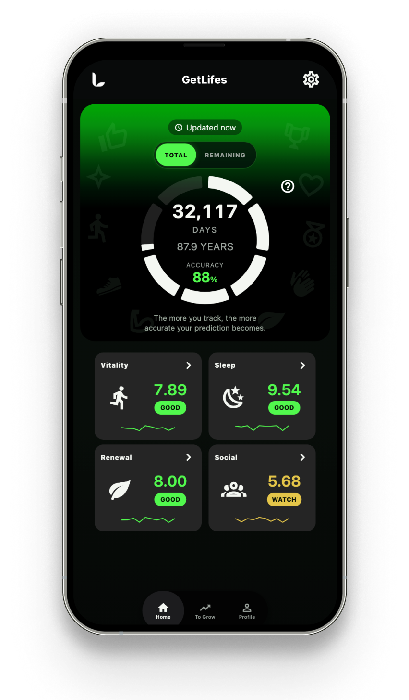

# Expo 通用模板

一个Expo的通用App结构，包含：**轮播页、首页、顶部栏、底部栏、设置页、页面左右滑动切换、语言设置**。

## 结构

```
app/
  _layout.js        # 根布局：手势容器 + 安全区 + 路由栈
  index.js          # 轮播页（入口，完成后进入首页）
  settings.js       # 设置页
  (tabs)/
    _layout.js      # Tab 布局：顶部栏 + 页面 + 底部栏
    home.js         # 首页（居中显示 Home，支持左右滑动切换）
    profile.js      # 资料页（居中显示 Profile，支持左右滑动切换）
components/
  carousel.js       # 轮播页组件（横向分页 + 占位图 + 圆点指示器 + 按钮）
  header.js         # 顶部栏（返回 / 标题 / 设置入口）
  tab-bar.js        # 底部栏（悬浮胶囊样式）
  tab-swipe.js      # 左右滑动切换 Tab 的手势封装
constants/
  theme.js          # 颜色与布局常量
  storage.js        # 持久化键名
state/
  onboarding-context.js # 引导完成状态（内存 + AsyncStorage 同步）
assets/
  01.png             # 轮播图（原 App 素材，共 4 张）
  02.png
  03.png
  04.png
  lifespan-logo-white.png # 顶部栏 logo（原 App 素材）
appstore/
  1.Predict-your-lifespan-1290x2796-自定义.jpg # 商店截图（原 App 素材，共 5 张）
  2.Lifestyle-1290x2796-自定义.jpg
  3.Improve-1290x2796-自定义.jpg
  4.Profile-1290x2796-自定义.jpg
  5.Data-1290x2796-自定义.jpg
```

## 轮播页演示



## 运行

```bash
npm install
npx expo start        # 然后按 i / a / w 打开 iOS / Android / Web
```


